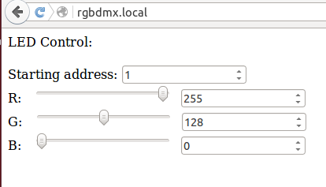

# RGB DMX example #

This example implements a web interface based on websockets and allows user to enter the channel and set RGB values, sent on the configured channel and two sequential ones as per general implementation practice in DMX.

You require and external RS485 driver IC to interface standard DMX equipment.

To use thix example [ESP-Dmx](https://github.com/IRNAS/ESP-Dmx) and [arduinoWebSockets](https://github.com/Links2004/arduinoWebSockets) libraties are required.

